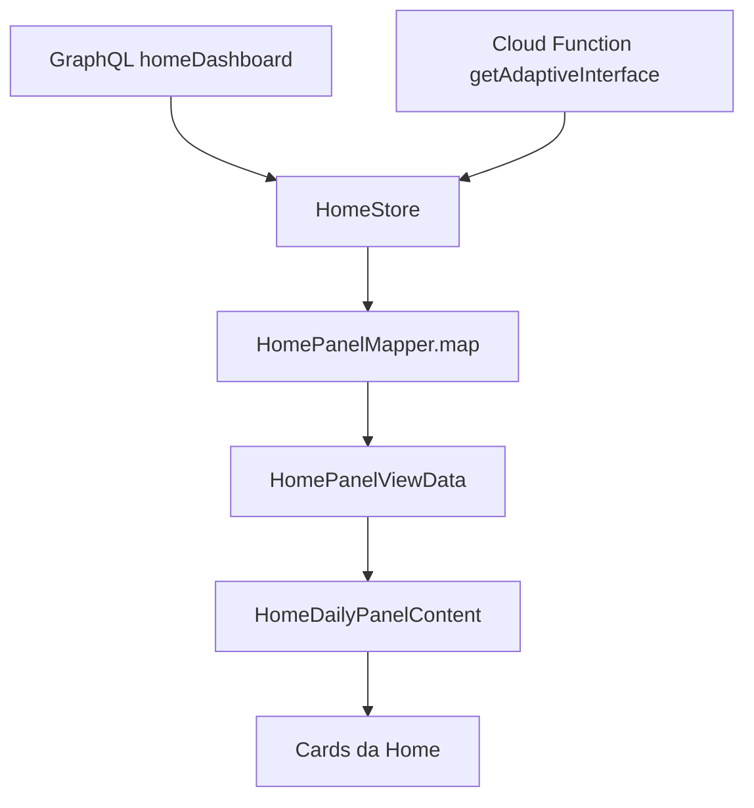

# Design SDD — Adaptação visual dos cards da nova Home

## Contexto

A Home já combina dados operacionais reais vindos de `homeDashboard` com sinais adaptativos vindos de `getAdaptiveInterface`. A lacuna atual está na camada de apresentação: os sinais `adaptiveCardType` e `cardOrder` não são convertidos em hierarquia visual relevante para os cards principais.

## Goals

- Concentrar a decisão adaptativa em `HomePanelMapper` e `HomePanelViewData`.
- Manter `homeDashboard` como fonte única dos dados exibidos.
- Usar `adaptiveCardType` e `cardOrder` como foco de interface, não como carousel legado.
- Entregar dados prontos para componentes visuais.
- Evitar crescimento de `home_page.dart`, `home_store.dart` e `adaptive_interface_service.dart`.

## Non-goals

- Não alterar GraphQL, Cloud Function ou contrato de backend.
- Não criar camada nova de domínio para esta decisão se o mapper atual resolver o escopo.
- Não implementar nova navegação, novo serviço adaptativo ou analytics.
- Não reestruturar toda a Home.

## Arquitetura proposta

### Princípio central

O mapper deve transformar dois grupos de entrada em uma view data estável:

1. Dados reais: `homeDashboard`.
2. Sinais de foco: `adaptiveCardType`, `cardOrder`, `dashboardConfidence`, `dashboardSource`.

Os componentes devem receber campos como foco ativo, prioridade de seções, destaques e recortes prontos, sem decidir se `tarefas` é mais importante que `producao`.

## Technical approach and design decisions

### Decisão 1 — Adaptação local sem alterar API

A feature deve interpretar localmente os sinais já disponíveis. Isso reduz risco de contrato, permite validar UX antes de mudar backend e evita bloquear a entrega em alterações de Cloud Function ou GraphQL.

### Decisão 2 — `adaptiveCardType` como foco, não tipo de card legado

`adaptiveCardType` deve ser normalizado para um foco visual interno. Exemplo conceitual:

- `tarefas` → foco de agenda e pendências.
- `lotes` → foco de cultivo e lotes.
- `producao` → foco de produção.
- `saude` → foco de atenção/risco.
- desconhecido → foco padrão.

### Decisão 3 — `cardOrder` como sinal secundário

`cardOrder` pode orientar prioridade relativa quando estiver coerente, mas não deve obrigar a criação de um carousel nem expor valores crus nos widgets.

### Decisão 4 — Fallback conservador

Baixa confiança, origem não adaptativa, tipo desconhecido ou dados ausentes devem preservar layout próximo ao atual. A adaptação não deve degradar a Home.

## Responsabilidades por arquivo

### `HomePanelMapper`

- Normalizar `adaptiveCardType` para foco visual interno.
- Avaliar se a recomendação é forte, fraca ou indisponível com base em `dashboardConfidence` e `dashboardSource`.
- Interpretar `cardOrder` como prioridade de apresentação quando aplicável.
- Selecionar recortes de `homeDashboard` adequados para o foco.
- Produzir `HomePanelViewData` com dados prontos para renderização.
- Tratar fallbacks para dados ausentes ou inconsistentes.

### `HomePanelViewData`

- Expor foco visual selecionado.
- Expor nível de adaptação aplicado.
- Expor blocos/destaques já derivados para consumo dos widgets.
- Preservar dados existentes necessários para compatibilidade com componentes atuais.
- Evitar carregar regra de negócio nos widgets.

### `HomeDailyPanelContent`

- Manter composição da Home.
- Encaminhar view data pronta para os componentes filhos.
- Evitar decidir foco adaptativo.

### `TodayCultivationPanel`

- Renderizar destaque de cultivo/lotes quando a view data indicar foco correspondente.
- Consumir dados preparados sobre lotes ativos, status, colheita próxima e culturas.

### `HomeProductionSummary`

- Renderizar destaque de produção quando a view data indicar foco correspondente.
- Consumir dados preparados sobre colheita, embalagens, produção mensal, taxas e comparativos.

### `RecommendedActionsSection`

- Continuar usando shortcuts adaptativos já existentes.
- Não incorporar nova regra para decidir foco principal da Home.

### `HomeModulesSection`

- Continuar como seção de módulos/atalhos estruturais.
- Só deve receber ajustes se a view data atual exigir passagem mínima de dados.

### `home_page.dart`

- Arquivo grande: não deve crescer com regra adaptativa.
- Se for necessário tocar, limitar a passagem mínima de dados já existentes para o mapper ou view data.

### `home_store.dart`

- Não deve receber nova lógica visual.
- Continua responsável por carregar e expor dados já existentes.

### `adaptive_interface_service.dart`

- Não deve ser alterado para esta feature.
- Continua representando integração com a Cloud Function existente.

## Data structures or interfaces involved

### Enum/view type sugerido — foco visual

Representação conceitual para orientar a implementação futura:

- `default`
- `tasks`
- `cultivation`
- `production`
- `health`

### Nível de adaptação sugerido

- `none`: sem recomendação aplicável.
- `soft`: recomendação fraca; destaque discreto.
- `strong`: recomendação confiável; destaque principal.

### View data sugerida

Campos conceituais a considerar em `HomePanelViewData`:

- `visualFocus`: foco normalizado.
- `adaptationLevel`: intensidade aplicada.
- `prioritySections`: lista normalizada de seções/recortes priorizados.
- `primaryHighlight`: destaque principal preparado.
- `secondaryHighlights`: destaques secundários preparados.
- `riskHighlight`: destaque de risco quando houver alerta crítico ou atraso relevante.
- `tasksFocusData`: recorte pronto para tarefas.
- `cultivationFocusData`: recorte pronto para lotes/cultivo.
- `productionFocusData`: recorte pronto para produção.
- `healthFocusData`: recorte pronto para saúde/risco.

Os nomes finais devem seguir os padrões existentes no código lido durante implementação.

## Mapeamento de foco

### Foco `tarefas`

Objetivo: priorizar tarefas e agenda.

Dados utilizados, conforme disponibilidade:

- `tarefas.pendentesHoje`
- `tarefas.atrasadas`
- `tarefas.pendentesSemana`
- `tarefas.porVencimento`
- `tarefas.porPrioridade`
- `tarefas.ultimasTarefas`

Comportamento esperado:

- Dar maior destaque a pendências de hoje e tarefas atrasadas.
- Usar vencimento/prioridade para ordenar ou resumir chamadas de atenção.
- Mostrar últimas tarefas como contexto secundário, não como substituto de pendências críticas.

### Foco `lotes`

Objetivo: priorizar lotes, cultivo e andamento operacional.

Dados utilizados, conforme disponibilidade:

- `resumo.lotesAtivos`
- `resumo.lotesFinalizados`
- `resumo.taxaConclusao`
- `resumo.lotesPorStatus`
- `resumo.lotesComColheitaProxima`
- `especiesEmAndamento`, quando derivável dos dados existentes
- `culturas`

Comportamento esperado:

- Destacar lotes ativos e colheita próxima.
- Usar status e taxa de conclusão como contexto de progresso.
- Mostrar culturas em andamento quando houver dados suficientes.

### Foco `producao`

Objetivo: priorizar métricas e evolução produtiva.

Dados utilizados, conforme disponibilidade:

- `producao.totalPlantasColhidas`
- `producao.totalEmbalagensProduzidas`
- `producao.producaoMensal`
- `producao.taxasMedia`
- `producao.comparativoPeriodo`
- `producao.culturaMaisProducao`

Comportamento esperado:

- Destacar totais de colheita e embalagens.
- Usar produção mensal e comparativo como tendência.
- Usar cultura com maior produção como insight secundário.

### Foco `saude`

Objetivo: priorizar atenção operacional, risco e saúde do fluxo.

Dados utilizados, conforme disponibilidade:

- `alertasCritico`
- `equipe.atividadesVencidas`
- `equipe.taxaConclusaoMedia`
- `equipe.atividadesNoPrazo`
- `producao.taxasMedia`
- `tarefas.atrasadas`

Comportamento esperado:

- Alertas críticos e atrasos devem aparecer com alta prioridade.
- Taxa de conclusão média e atividades no prazo devem contextualizar saúde operacional.
- Taxas médias de produção podem indicar tendência ou anomalia quando já disponíveis.

## Estratégia de fallback

### Baixa confiança

- Aplicar `adaptationLevel = soft` ou `none`.
- Preservar ordem visual padrão.
- Permitir apenas sinalização discreta do foco, sem reposicionamento agressivo.

### `dashboardSource` não adaptativo

- Tratar recomendação como default/fallback.
- Manter hierarquia padrão da Home.
- Não ignorar dados críticos já existentes, como alertas críticos.

### `cardType` desconhecido

- Normalizar para `default`.
- Não quebrar renderização.
- Opcionalmente manter `hasDashboardSupport` se esse comportamento já existir e fizer sentido.

### Dados ausentes

- Não exibir card vazio.
- Diferenciar zero válido de ausência quando o modelo atual permitir.
- Degradar para o próximo recorte disponível do mesmo foco.
- Se nenhum recorte do foco estiver disponível, voltar ao destaque padrão.

### `cardOrder` inconsistente

- Ignorar itens desconhecidos.
- Remover duplicatas na normalização.
- Não permitir que `cardOrder` oculte alertas críticos relevantes.

## Acceptance criteria

- A decisão de foco visual é produzida no mapper/view data.
- Os widgets recebem dados prontos e não precisam interpretar `adaptiveCardType` cru.
- Cada foco conhecido tem mapeamento explícito para dados existentes de `homeDashboard`.
- Fallbacks para confiança, source, tipo desconhecido e dados ausentes são definidos e testáveis.
- Nenhum contrato externo precisa mudar.

## Open questions que precisam de clarificação

1. Qual nomenclatura real dos valores de `cardType` enviados hoje pela Cloud Function?
2. O produto aceita reordenar visualmente blocos internos dos cards ou apenas mudar destaque dentro de cada bloco?
3. Existe regra de negócio para alertas críticos sempre prevalecerem sobre qualquer foco adaptativo?
4. Qual threshold numérico deve separar adaptação `soft` de `strong`?
