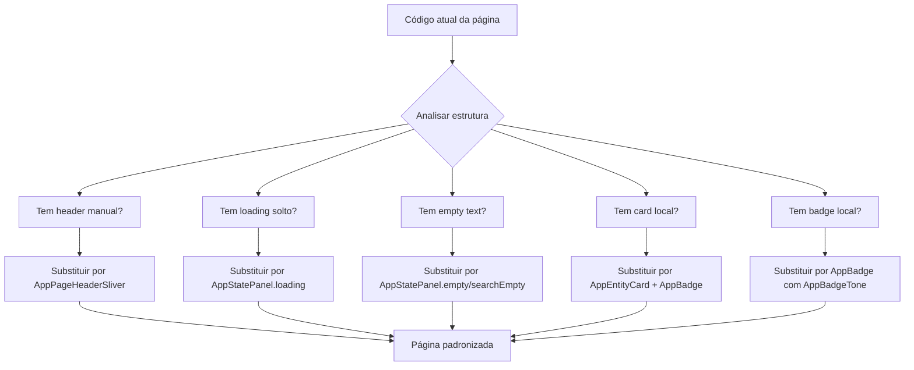
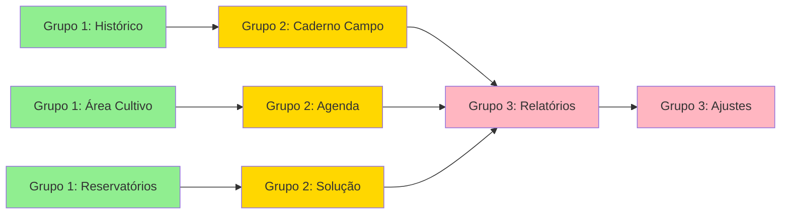

# Padronização Visual de Todos os Módulos — Design

**Spec**: `.specs/features/visual-standardization-all-modules/spec.md`
**Status**: Draft
**Agent**: architect (tlc-spec-driven)

---

## Architecture Overview

A padronização é estritamente visual e não altera arquitetura. O padrão já estabelecido é:

```
Presenter Page
  ├── AppPageHeaderSliver (header padronizado)
  │   ├── título + subtítulo
  │   ├── botão voltar
  │   ├── actions (opcional)
  │   └── bottom → AppSearchBar (opcional)
  ├── AppStatePanel (loading / empty / searchEmpty / error)
  ├── AppEntityCard (itens de listagem)
  │   ├── AppBadge (status)
  │   ├── AppIconTile (ícone semântico)
  │   └── metadata (Wrap)
  └── FloatingActionButton (add, quando aplicável)
```

Cada página afetada será modificada apenas no widget `build`, substituindo:
- Headers manuais → `AppPageHeaderSliver`
- `CircularProgressIndicator` + `Padding` → `AppStatePanel` loading
- `Text` + `Padding` para vazio → `AppStatePanel` empty
- Cards locais (`Card`, `InkWell`, `Container` decorado) → `AppEntityCard`
- Badges locais (`Container` decorado com texto) → `AppBadge`
- Cores literais → `Constants.*` ou `AppBadgeTone`

### Diagrama de fluxo da migração



---

## Code Reuse Analysis

### Componentes Compartilhados Existentes (já disponíveis)

| Componente | Arquivo | Já usado por | Será usado por |
|---|---|---|---|
| `AppPageHeaderSliver` | `widgets/common/app_page_header_sliver.dart` | Protocolo, Equipe, Reservatório, Caderno Campo, Área Cultivo, Agenda, Ajustes | Histórico, Relatórios, Solução |
| `AppSearchBar` | `widgets/common/app_search_bar.dart` | Protocolo, Equipe, Reservatório, Caderno Campo | Histórico, Área Cultivo (opcional) |
| `AppStatePanel` | `widgets/common/app_state_panel.dart` | Protocolo, Equipe, Reservatório, Caderno Campo, Área Cultivo, Solução, Agenda (parcial) | Histórico, Agenda (completar) |
| `AppEntityCard` | `widgets/common/app_entity_card.dart` | Equipe, Relatórios | Reservatório, Caderno Campo, Área Cultivo, Agenda, Solução, Histórico |
| `AppBadge` | `widgets/common/app_badge.dart` | Equipe, Relatórios | Histórico, Caderno Campo |
| `AppIconTile` | `widgets/common/app_icon_tile.dart` | Relatórios | (onde houver ícone semântico) |
| `AppPanelCard` | `widgets/common/app_panel_card.dart` | (base do AppEntityCard) | (uso indireto via AppEntityCard) |

### Padrão de Referência — ProtocoloPage

```dart
// Header
AppPageHeaderSliver(
  title: 'Meus Protocolos',
  subtitle: 'Lista de protocolos cadastrados',
  expandedHeight: 180,
  floating: true,
  onBack: () => Get.back(),
  bottom: PreferredSize(
    preferredSize: const Size(double.infinity, 60),
    child: AppSearchBar(
      hintText: 'Buscar protocolo...',
      onChanged: store.setSeachProtocoloPage,
    ),
  ),
);

// Estados
AppStatePanel(stateKind: AppStateKind.loading, title: 'Carregando...');
AppStatePanel(stateKind: AppStateKind.empty, title: 'Nenhum...', message: '...');
AppStatePanel(stateKind: AppStateKind.searchEmpty, title: 'Nenhum...', message: '...');

// Lista
SliverList(delegate: SliverChildBuilderDelegate(...));
```

---

## Components — Mapa de Mudanças por Módulo

### Grupo 1 — Implementar primeiro (maior gap, menor risco)

#### 1. Histórico (`historico_page.dart`)

**Arquivo**: `lib/features/presenter/views/historico/historico_page.dart`
**Responsabilidade**: Listagem de lotes finalizados
**Mudanças**:
| Item atual | Substituir por | VS Req |
|---|---|---|
| `AppBar` local (SliverAppBar manual com TopAppBarArea) | `AppPageHeaderSliver` com título "Histórico" e subtítulo "Lotes finalizados" | VS-HEADER-01 |
| `CircularProgressIndicator` com Padding | `AppStatePanel(stateKind: AppStateKind.loading)` | VS-STATE-01 |
| `Text` solto "Não há lotes finalizados ainda!" | `AppStatePanel(stateKind: AppStateKind.empty)` | VS-STATE-02 |
| `CardLoteFinalizado` local com `Card` + `InkWell` | `AppEntityCard` com `AppBadge` para status "Finalizado" | VS-CARD-01, VS-CARD-02 |
| Badge "Finalizado" com `Container` decorado | `AppBadge(label: 'FINALIZADO', tone: AppBadgeTone.neutral)` | VS-CARD-02 |
| Divider, cor hardcoded, padding manual | Remover — `AppEntityCard` já trata padding | VS-CARD-01 |
| `elevation: 2` + `borderRadius: 15` | `AppEntityCard` usa `AppPanelCard` com raio 20 e sombra leve | VS-CARD-01 |

**Dependências**: Nenhuma — página isolada, sem componentes importados de outros módulos.
**Risco**: Baixo — página pequena e simples (~275 linhas).

---

#### 2. Área de Cultivo — Listagem Principal (`area_cultivo_page.dart`)

**Arquivo**: `lib/features/presenter/views/area_cultivo/N1/area_cultivo_page.dart`
**Responsabilidade**: Listagem de áreas de cultivo (N1 da hierarquia)
**Mudanças**:
| Item atual | Substituir por | VS Req |
|---|---|---|
| `CircularProgressIndicator` com Padding | `AppStatePanel(stateKind: AppStateKind.loading)` | VS-STATE-01 |
| `CardArea` local (widget interno no mesmo arquivo) | `AppEntityCard` com dados mapeados | VS-CARD-01 |
| Sem search bar | Adicionar `AppSearchBar` via `bottom` do header (se store tiver filtro de texto) | VS-HEADER-02 |

**Observação**: `CardArea` está no mesmo arquivo (area_cultivo_page.dart ~320 linhas). A extração para `AppEntityCard` reduz o tamanho do arquivo.
**Risco**: Médio — arquivo já tem 320 linhas; a substituição de `CardArea` por `AppEntityCard` deve diminuir, não aumentar.

---

#### 3. Reservatórios — Completar (`reservatorios_page.dart`)

**Arquivo**: `lib/features/presenter/views/reservatorio/reservatorios_page.dart`
**Responsabilidade**: Listagem de reservatórios (já tem header e search padronizados)
**Mudanças**:
| Item atual | Substituir por | VS Req |
|---|---|---|
| `reservatorioItem` local (componente importado) | `AppEntityCard` com dados mapeados | VS-CARD-01 |
| `ElevatedButton` "nome" no trailing do search | Remover (não está em Protocolo), usar `AppSearchBar` limpo | VS-HEADER-02 |

**Risco**: Baixo — página já tem 90% da estrutura moderna.

---

### Grupo 2 — Implementar depois

#### 4. Caderno de Campo (`caderno_campo_page.dart`)

**Arquivo**: `lib/features/presenter/views/caderno_campo/caderno_campo_page.dart`
**Responsabilidade**: Listagem de lotes com filtros Área/Setor
**Mudanças**:
| Item atual | Substituir por | VS Req |
|---|---|---|
| `CardLote` local (~165 linhas no mesmo arquivo) | `AppEntityCard` com dados do lote | VS-CARD-01 |
| Ícone `eco` como leading | `leading: AppIconTile(icon: Icons.eco, color: ...)` ou mantido como ícone simples | VS-CARD-01 |
| Badge manual (se houver) | `AppBadge` | VS-CARD-02 |

**Risco**: Médio — `CardLote` tem 165 linhas com layout complexo (Row, Column, ícones, datas). Requer mapeamento cuidadoso dos campos para `AppEntityCard.title`, `AppEntityCard.subtitle`, `AppEntityCard.description`, `AppEntityCard.metadata`, `AppEntityCard.leading`, `AppEntityCard.badges`.

**Estratégia**: Extrair `CardLote` para arquivo separado primeiro, refatorar para composition local com `AppPanelCard`, depois substituir por `AppEntityCard`. (VS-EDGE-02)

---

#### 5. Agenda (`agenda_page.dart`)

**Arquivo**: `lib/features/presenter/views/agenda/agenda_page.dart`
**Responsabilidade**: Calendário + listagem de atividades
**Mudanças**:
| Item atual | Substituir por | VS Req |
|---|---|---|
| Empty state com `Container` + `Text` local | `AppStatePanel(stateKind: AppStateKind.empty)` | VS-STATE-02 |
| `Scaffold.backgroundColor: Constants.kBackgroundColor` | `Constants.kSecondBackgroundColor` | VS-BG-01 |
| `agendaItem` local (componente importado de agenda_item.dart) | Pode manter — item de agenda é contextual. Se possível, usar `AppEntityCard` simplificado | VS-CARD-01 (opcional) |

**Risco**: Baixo — mudanças pontuais. O `agendaItem` pode permanecer local por ser contextual com calendário.

---

#### 6. Solução (`solucao_page.dart`)

**Arquivo**: `lib/features/presenter/views/solucao/solucao_page.dart`
**Responsabilidade**: Listagem de soluções nutritivas
**Mudanças**:
| Item atual | Substituir por | VS Req |
|---|---|---|
| `SolucaoPageHeader` local (componente separado) | `AppPageHeaderSliver` | VS-HEADER-01 |
| `SolucaoReceitaCard` local | `AppEntityCard` (se o card for de listagem simples) | VS-CARD-01 |

**Risco**: Baixo — `SolucaoPageHeader` é um componente separado. Basta substituir no `solucao_page.dart`.

---

### Grupo 3 — Ajustes finos

#### 7. Relatórios (`relatorios_page.dart`)

**Arquivo**: `lib/features/presenter/views/relatorios/relatorios_page.dart`
**Responsabilidade**: Página inicial de relatórios com cards de atalho
**Mudanças**:
| Item atual | Substituir por | VS Req |
|---|---|---|
| `_RelatoriosAppBar` local (~58 linhas) | `AppPageHeaderSliver` | VS-HEADER-01 |
| Cores hardcoded nos badges: `Color(0xFF059669)` etc. | `AppBadge(label: 'Disponível', tone: AppBadgeTone.success)` | VS-TOKEN-01 |

**Risco**: Baixo — página já usa `AppEntityCard`, `AppBadge`, `AppIconTile`. Apenas header e tokens.

---

#### 8. Ajustes (`ajustes_page.dart`)

**Arquivo**: `lib/features/presenter/views/ajuste/ajustes_page.dart`
**Responsabilidade**: Formulário de ajuste de reposição
**Mudanças**:
| Item atual | Substituir por | VS Req |
|---|---|---|
| Header já usa `AppPageHeaderSliver` | Manter | — |
| Formulário é especializado | Manter — fora de escopo | — |
| `ButtonWidget` local | Remover (não utilizado?) | — |
| `MySeparator` local | Manter (componente de linha tracejada, sem equivalente no common) | — |

**Risco**: Muito Baixo — apenas limpeza de widgets locais não utilizados.

---

## Módulos que NÃO serão alterados (já padronizados)

| Módulo | Status |
|---|---|
| Protocolo | Referência moderna completa |
| Gerenciar Equipe | Moderno com AppEntityCard, AppBadge, AppPageHeaderSliver |
| Home | Padronizado em spec separada |
| Login / Cadastro / MultiAccounts | Padronizado via auth-visual-standardization |
| Recuperar Senha | Fora de escopo |
| Onboarding | Fora de escopo |
| Adaptive Admin | Módulo administrativo |

---

## Data Models

Nenhum modelo de dados novo é necessário. As páginas continuarão usando:
- Models de domínio existentes (`Lote`, `Area`, `Protocolo`, `Reservatorio`, `Usuario`, etc.)
- Stores existentes (`ProtocoloStore`, `ReservatoriosStore`, etc.)
- Dados de apresentação já mapeados pelas páginas

**Mapeamento de dados para `AppEntityCard`**:

| Campo AppEntityCard | Fonte de dados típica |
|---|---|
| `title` | `model.nome ?? ''` |
| `subtitle` | `model.subtitle ?? ''` ou cargo/vínculo |
| `description` | `model.descricao` ou metadado textual |
| `leading` | `AppIconTile` ou `Icon` |
| `badges` | `[AppBadge(label: status, tone: tone)]` |
| `metadata` | `[Text('${model.data}')]` |
| `onTap` | `() => store.selecionar(model); Get.toNamed(...)` |

---

## Error Handling Strategy

| Erro | Estratégia |
|---|---|
| Store não carregou dados | Manter `AppStatePanel.loading` até store indicar pronto |
| Store retornou lista vazia | Exibir `AppStatePanel.empty` |
| Store não tem `isLoading` flag | Manter comportamento existente (não adicionar lógica nova) |
| Componente compartilhado não cobre caso | Manter widget local e documentar |

---

## Boundary Rules (obrigatório)

1. Não importar componentes de Home/Auth em módulos operacionais
2. Não acessar `Get`, `GetIt`, stores, services, repositories dentro de componentes compartilhados
3. `AppEntityCard` recebe dados de apresentação já mapeados pela página — não recebe models de domínio obrigatórios
4. Navegação continua na página, não no componente compartilhado
5. `AppSearchBar` apenas emite `onChanged` — não filtra lista internamente
6. Estados são decididos pela página/store, não pelo componente

---

## Decisões de Design

| Decisão | Escolha | Rationale |
|---|---|---|
| `expandedHeight` padrão | 180 | Consistente com Protocolo (referência) |
| `floating` no SliverAppBar | true | Comportamento consistente com scroll |
| `pinned` no SliverAppBar | false | Apenas header flutua com scroll |
| `CardLote` decomposição | Extrair para arquivo separado antes de migrar | Impedir aumento de arquivo grande (~400 linhas) |
| `agendaItem` | Manter local (não migrar para AppEntityCard) | Item contextual com calendário, baixo benefício |
| `SolucaoReceitaCard` | Avaliar se encaixa em AppEntityCard | Card tem formato de grid/receita, pode não ser compatível |

---

## Implementation Order (DAG)



**Paralelização possível**:
- Grupo 1: Histórico, Área Cultivo e Reservatórios podem rodar em paralelo (arquivos independentes)
- Grupo 2: Caderno Campo depende de análise do CardLote (pode começar depois que Histórico validar o padrão)
- Grupo 3: Só após Grupo 2

---

## Dados para Tasks

### Arquivos a serem tocados (todos na camada presenter/views)

**Grupo 1**:
1. `lib/features/presenter/views/historico/historico_page.dart` — Reescrever build
2. `lib/features/presenter/views/area_cultivo/N1/area_cultivo_page.dart` — Loading + cards + search
3. `lib/features/presenter/views/reservatorio/reservatorios_page.dart` — Card item + search trailing
4. `lib/features/presenter/views/reservatorio/cadastrar_reservatorio/components/reservatorioItem.dart` — Se aplicável

**Grupo 2**:
5. `lib/features/presenter/views/caderno_campo/caderno_campo_page.dart` — CardLote → AppEntityCard
6. `lib/features/presenter/views/agenda/agenda_page.dart` — Empty + background
7. `lib/features/presenter/views/solucao/solucao_page.dart` — Header
8. `lib/features/presenter/views/solucao/components/solucao_page_header.dart` — Remover (se não usado em mais nada)

**Grupo 3**:
9. `lib/features/presenter/views/relatorios/relatorios_page.dart` — Header + tokens
10. `lib/features/presenter/views/ajuste/ajustes_page.dart` — Cleanup (opcional)

### Arquivos que NÃO devem ser tocados

- `lib/features/presenter/widgets/common/*` — Já existem; não serão alterados
- Nenhum arquivo em `lib/core/`, `lib/features/data/`, `lib/features/presenter/viewmodels/`, `lib/features/presenter/routes/`
- Nenhum arquivo de Home, Login, Cadastro, Auth

### Validação após cada task

```bash
# Typecheck
cd /home/joao/Documentos/personal/mestras/osi-solucoes
dart analyze lib/features/presenter/views/<modulo>/
# ou
flutter analyze
```
