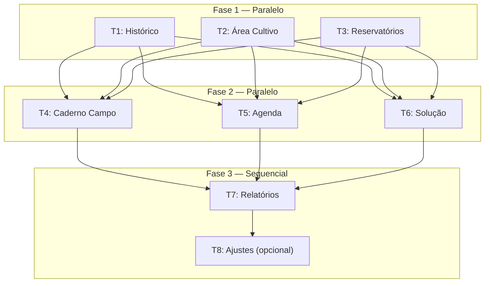

# Padronização Visual de Todos os Módulos — Tasks

**Design**: `.specs/features/visual-standardization-all-modules/design.md`
**Status**: Draft
**Agent**: architect (tlc-spec-driven)

---

## Resumo

3 grupos, 10 tarefas atômicas, 3 fases. Cada tarefa toca UM arquivo principal e produz UM resultado verificável.

---

## Execution Plan

### Legenda

| Ícone | Significado |
|---|---|
| 🔧 | Implementação |
| ✅ | Validação |
| 📦 | Pré-requisito |
| 🔀 | Pode rodar em paralelo |

---

### Fase 1 — Grupo 1: Maior gap, menor risco (Paralelizável)

Arquivos independentes — podem rodar em paralelo.

```
T1 ──┐
T2 ──┼── (paralelo)
T3 ──┘
```

#### T1: Padronizar Histórico (`historico_page.dart`)

**Arquivo**: `lib/features/presenter/views/historico/historico_page.dart`
**Responsabilidade**: Substituir header, loading, empty, cards e badges pelos componentes compartilhados
**Esforço**: ~1h

**Sub-tarefas**:
1. Substituir `AppBar` local (SliverAppBar + `TopAppBarArea`) por `AppPageHeaderSliver` com `title: 'Histórico'`, `subtitle: 'Lotes finalizados'`, `onBack: () => Get.back()`
2. Substituir `CircularProgressIndicator` + `Padding` por `AppStatePanel(stateKind: AppStateKind.loading, ...)`
3. Substituir `Text` solto "Não há lotes finalizados ainda!" por `AppStatePanel(stateKind: AppStateKind.empty, ...)`
4. Substituir `CardLoteFinalizado` (widget local) por `AppEntityCard` + `AppBadge`
5. Remover imports não utilizados (ex: `topAppBarArea.dart` se não for mais usado)

**Mapeamento `CardLoteFinalizado` → `AppEntityCard`**:
- `leading`: `AppIconTile(icon: Icons.eco, color: Color(0xFF26C165))` ou `Icon(Icons.eco, color: Color(0xFF26C165), size: 26)`
- `title`: `widget.lote.nome ?? ''`
- `subtitle`: (vazio ou "Lote #id")
- `badges`: `[AppBadge(label: 'FINALIZADO', tone: AppBadgeTone.neutral)]`
- `metadata`: (opcional) data se aplicável
- `onTap`: manter `store.selecionarLote(widget.lote); Get.to(...)`

**Validação**: `dart analyze lib/features/presenter/views/historico/`

**Dependências**: Nenhuma

**Requisitos**: VS-HEADER-01, VS-STATE-01, VS-STATE-02, VS-CARD-01, VS-CARD-02

---

#### T2: Padronizar Área de Cultivo — Listagem Principal (`area_cultivo_page.dart`)

**Arquivo**: `lib/features/presenter/views/area_cultivo/N1/area_cultivo_page.dart`
**Responsabilidade**: Substituir loading, cards e adicionar search (se aplicável)
**Esforço**: ~1h30

**Sub-tarefas**:
1. Substituir `CircularProgressIndicator` + `Padding` por `AppStatePanel(stateKind: AppStateKind.loading, ...)`
2. Substituir `CardArea` (widget local no mesmo arquivo) por `AppEntityCard`
3. Se a store tiver filtro de busca (`setSearchAreaText` ou similar), adicionar `AppSearchBar` via `bottom` do `AppPageHeaderSliver`
4. Verificar se o header já usa `AppPageHeaderSliver` (parece que sim)

**Mapeamento `CardArea` → `AppEntityCard`**:
- `leading`: `Icon(Icons.agriculture_outlined, ...)` (ou ícone equivalente)
- `title`: área.nome
- `subtitle`: área.descricao (se houver)
- `badges`: (status se aplicável)
- `onTap`: `store.setAreaSelecionada(area); Get.toNamed(...)`

**Validação**: `dart analyze lib/features/presenter/views/area_cultivo/N1/`

**Dependências**: Nenhuma

**Requisitos**: VS-STATE-01, VS-CARD-01, VS-HEADER-02 (se adicionar search)

---

#### T3: Completar Reservatórios (`reservatorios_page.dart`)

**Arquivo**: `lib/features/presenter/views/reservatorio/reservatorios_page.dart`
**Responsabilidade**: Substituir card item local e limpar search trailing
**Esforço**: ~30min

**Sub-tarefas**:
1. Substituir `reservatorioItem` por `AppEntityCard` inline ou via adapter
2. Remover o `ElevatedButton` "nome" do trailing do `AppSearchBar`
3. Ajustar import de `reservatorioItem.dart` se não for mais usado

**Mapeamento `reservatorioItem` → `AppEntityCard`**:
- `leading`: (ícone de reservatório ou null)
- `title`: `reservatorio.nome ?? ''`
- `subtitle`: (capacidade, localização ou null)
- `badges`: (status se aplicável)
- `onTap`: `store.setIsEditing(false); Get.toNamed(Routes.detalhesReservatorioPage, arguments: reservatorio)`

**Validação**: `dart analyze lib/features/presenter/views/reservatorio/`

**Dependências**: Nenhuma

**Requisitos**: VS-CARD-01, VS-HEADER-02

---

### Fase 2 — Grupo 2: Gap médio (Sequencial parcial)

```
T1 ── T2 ── T3 ──┐
                  ├── (T1 do Grupo 2 depende de T1 do Grupo 1 validar o padrão)
                  │
T4 ── T5 ── T6 ──┘
```

#### T4: Padronizar Caderno de Campo (`caderno_campo_page.dart`)

**Arquivo**: `lib/features/presenter/views/caderno_campo/caderno_campo_page.dart`
**Responsabilidade**: Substituir `CardLote` por `AppEntityCard`
**Esforço**: ~2h

**Sub-tarefas**:
1. **Extrair `CardLote` para arquivo separado** (`caderno_campo_page.dart` tem ~400 linhas)
2. Refatorar `CardLote` para usar `AppEntityCard` com:
   - `leading`: `AppIconTile(icon: Icons.eco, color: ...)` ou Icon simples
   - `title`: `lote.nome ?? ''`
   - `subtitle`: `"# ${lote.id}"`
   - `description`: `"Cultura: ${lote.cultura?.nome}"`
   - `metadata`: datas de registro/colheita se aplicável
   - `badges`: (status se aplicável)
   - `onTap`: manter `store.setLoteSelecionado(lote); Get.toNamed(...)`
3. Manter os dropdowns de filtro (Área/Setor) — são específicos do módulo

**Mapeamento de campos**:
| CardLote atual | AppEntityCard |
|---|---|
| `Icon(Icons.eco, size: 26, color: 0xFF26C165)` | `leading` |
| `"# ${widget.lote.id}"` | Incluir no `title` ou `subtitle` |
| `widget.lote.nome` | `title` |
| `"Cultura: ${widget.lote.cultura?.nome}"` | `description` |
| Datas de registro/colheita | `metadata` |
| `Icon(Icons.chevron_right_rounded)` (implícito) | Já incluso via `onTap` |
| `Card(elevation: 2, borderRadius: 15)` | `AppPanelCard` (raio 20, sombra leve) |

**Validação**: `dart analyze lib/features/presenter/views/caderno_campo/`

**Dependências**: Nenhuma (pode começar depois da Fase 1)

**Requisitos**: VS-CARD-01, VS-CARD-03, VS-EDGE-02

---

#### T5: Padronizar Agenda (`agenda_page.dart`)

**Arquivo**: `lib/features/presenter/views/agenda/agenda_page.dart`
**Responsabilidade**: Substituir empty state e corrigir background
**Esforço**: ~30min

**Sub-tarefas**:
1. Substituir empty state (linhas ~351-381: `_emptyList` com `Container` + `Text`) por `AppStatePanel(stateKind: AppStateKind.empty, ...)`
2. Alterar `Scaffold.backgroundColor: Constants.kBackgroundColor` → `Constants.kSecondBackgroundColor`
3. Manter `agendaItem` local (componente contextual com calendário)

**Validação**: `dart analyze lib/features/presenter/views/agenda/`

**Dependências**: Nenhuma

**Requisitos**: VS-STATE-02, VS-BG-01

---

#### T6: Padronizar Solução (`solucao_page.dart`)

**Arquivo**: `lib/features/presenter/views/solucao/solucao_page.dart`
**Responsabilidade**: Substituir header local por `AppPageHeaderSliver`
**Esforço**: ~30min

**Sub-tarefas**:
1. Substituir `SolucaoPageHeader(store: solucaoStore)` por `AppPageHeaderSliver` com `title: 'Soluções'`, `subtitle: 'Lista de soluções nutritivas'`, `onBack: () => Get.back()`, `bottom: PreferredSize(...)` com `AppSearchBar`
2. Verificar se `SolucaoPageHeader` é usado em outro lugar. Se não, considerar remover o arquivo `solucao_page_header.dart` (opcional)
3. Manter `SolucaoReceitaCard` (card em grid, pode não encaixar em `AppEntityCard` — avaliar)

**Validação**: `dart analyze lib/features/presenter/views/solucao/`

**Dependências**: Nenhuma

**Requisitos**: VS-HEADER-01, VS-HEADER-02

---

### Fase 3 — Grupo 3: Ajustes finos (Sequencial, dependem da Fase 2)

```
T4 ── T5 ── T6 ──→ T7 ──→ T8
```

#### T7: Padronizar Relatórios (`relatorios_page.dart`)

**Arquivo**: `lib/features/presenter/views/relatorios/relatorios_page.dart`
**Responsabilidade**: Substituir header local e corrigir tokens de cor
**Esforço**: ~30min

**Sub-tarefas**:
1. Substituir `_RelatoriosAppBar` por `AppPageHeaderSliver` com `title: 'Relatórios'`, `subtitle: 'Análises e métricas da produção'`, `onBack: () => Get.back()`
2. Substituir cores hardcoded nos badges: `Color(0xFF059669)` → `AppBadgeTone.success`, etc.
3. Manter `_SectionLabel` e `_RelatorioCard` (que já usa `AppEntityCard`)

**Mapeamento de cores**:
| Cor atual | Substituir por |
|---|---|
| `Color(0xFF059669)` (verde) | `AppBadgeTone.success` |
| `Color(0xFF7C3AED)` (roxo) | Manter no `iconColor` (não tem tone) |
| `Color(0xFFEA580C)` (laranja) | Manter no `iconColor` |
| `Color(0xFF0891B2)` (ciano) | Manter no `iconColor` |

**Validação**: `dart analyze lib/features/presenter/views/relatorios/`

**Dependências**: Nenhuma

**Requisitos**: VS-HEADER-01, VS-TOKEN-01

---

#### T8: Limpeza Ajustes (`ajustes_page.dart`) — Opcional

**Arquivo**: `lib/features/presenter/views/ajuste/ajustes_page.dart`
**Responsabilidade**: Header já ok; verificar widgets locais não utilizados
**Esforço**: ~15min

**Sub-tarefas**:
1. Verificar se `ButtonWidget` (linhas 623-663) é utilizado. Se não, remover.
2. Manter `MySeparator` (componente de linha tracejada, sem equivalente no common)
3. Nenhuma outra mudança necessária

**Validação**: `dart analyze lib/features/presenter/views/ajuste/`

**Dependências**: Nenhuma

**Requisitos**: Nenhum requisito direto — tarefa de housekeeping

---

## Diagrama de Dependências



> **Nota**: As setas indicam validação cruzada do padrão, não dependência de código. Cada tarefa pode ser implementada isoladamente. A seta indica "só iniciar esta após pelo menos uma da fase anterior ter validado o padrão visual".

---

## Resumo de Arquivos

| # | Arquivo | Task | Ação |
|---|---|---|---|
| 1 | `lib/features/presenter/views/historico/historico_page.dart` | T1 | Reescrever build |
| 2 | `lib/features/presenter/views/area_cultivo/N1/area_cultivo_page.dart` | T2 | Loading + cards + search |
| 3 | `lib/features/presenter/views/reservatorio/reservatorios_page.dart` | T3 | Card item + search trailing |
| 4 | `lib/features/presenter/views/caderno_campo/caderno_campo_page.dart` | T4 | CardLote → AppEntityCard |
| 5 | `lib/features/presenter/views/agenda/agenda_page.dart` | T5 | Empty + background |
| 6 | `lib/features/presenter/views/solucao/solucao_page.dart` | T6 | Header |
| 7 | `lib/features/presenter/views/relatorios/relatorios_page.dart` | T7 | Header + tokens |
| 8 | `lib/features/presenter/views/ajuste/ajustes_page.dart` | T8 | Cleanup |

**Arquivos que NÃO serão tocados**: Todos em `core/`, `data/`, `viewmodels/`, `routes/`, `widgets/common/`

---

## Validação Geral

```bash
# Após cada tarefa
dart analyze lib/features/presenter/views/<modulo>/

# Após todas as tarefas (full project)
cd /home/joao/Documentos/personal/mestras/osi-solucoes && flutter analyze

# Validação visual (manual): abrir cada módulo e comparar com Protocolo como referência
```

---

## Checklist Final

- [ ] T1: Histórico padronizado (header, loading, empty, cards, badges)
- [ ] T2: Área Cultivo padronizada (loading, cards, search)
- [ ] T3: Reservatórios completo (cards, search limpo)
- [ ] T4: Caderno Campo padronizado (CardLote → AppEntityCard)
- [ ] T5: Agenda padronizada (empty, background)
- [ ] T6: Solução padronizada (header)
- [ ] T7: Relatórios padronizado (header, tokens)
- [ ] T8: Ajustes cleanup (opcional)
- [ ] `dart analyze` passa sem erros
- [ ] `flutter analyze` passa sem erros
- [ ] Nenhum arquivo fora de `presenter/views/` foi alterado
- [ ] Nenhuma store, rota, serviço, modelo ou regra de negócio foi alterada
